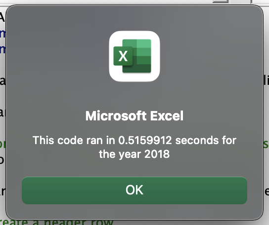
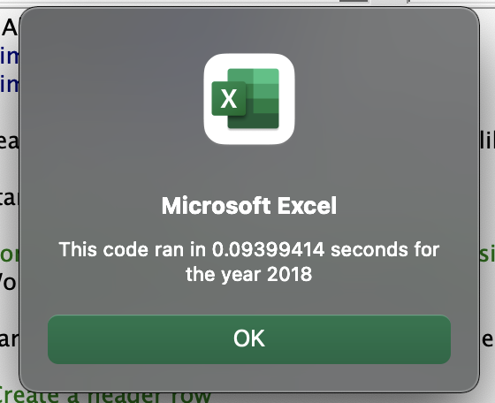

# 2stock-analysis
Stock analysis for Steve's parents
# Overview of Project

## Purpose

The purpose of this is analysis was to acquire an overall understanding of the inner workings of excel and how to apply said understandings. Being able to see the back end of excel shows that there are a multitude of ways to visualize data in excel and that just using excel’s UI can sometimes be limiting. Writing code in Visual Basic also moderately prepared me to write code in python. I say moderately because the syntax quite different but concepts still hold true.

## Background

My friend Steve, a recent college graduate approached me with the task of helping him analyze stock data for sustainable companies so that his parent could make a well-informed decision on what company to invest and not just based on them meeting at Dairy Queen.

# Results

## Analysis

Steve made the right decision coming to me to analyze this stock data because I was able to show him that it would be bad decision for his parents to invest in DQ as their return in 2018 was -62.6% and that they should probably look elsewhere to invest there money. A company like RUN would be much better decision since their 2018 return was 84%.

## Summary

The main advantage of refactoring code is that you already have a solid base to work with but I feel that is a double edged sword when talking about refactoring code because that is also a disadvantage. The advantage is that, if the code was written clearly and commented on then it might not take long to meet your goal. On the other hand, if your original code isn’t written clearly, refactoring the code could be a very intense task. Overall refactoring this code made a huge difference in the run time of the code as you can see below. My touches to the original code sped up the run time by a significant amount.

